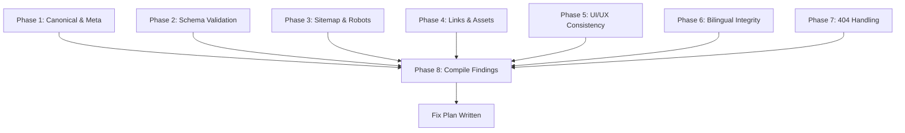

# 🗺️ Pre-Launch SEO & Quality Audit — Al-Fares Lab Website
> **Version:** 1.0.0
> **Date:** 2026-05-04
> **Methodology:** Multi-Model Development
> **Type:** Audit (Read-Only — NO code modifications)
> **Reference:** `docs/SEO_Indexing_and_Publishing_Strategy.md`, `master-constitution.md` §5

---

## 🎯 Goal

Perform a comprehensive, read-only pre-launch audit of the entire Al-Fares website (27+ pages across AR and EN) to verify compliance with SEO indexing rules, Schema.org requirements, UI/UX standards, and bilingual integrity before the next production deployment.

### Key Outcomes:
1. **Findings log** — every check item documented with ✅ (pass) or ❌ (fail) status
2. **Fix plan** — actionable remediation steps based on findings (to be executed in a separate plan)
3. **Zero code changes** — this plan is observation-only

### Scope — Full Page Inventory:

| Group | Pages | Count |
|-------|-------|-------|
| **Root (AR)** | `index.html`, `about-lab.html`, `privacy-policy.html`, `404.html` | 4 |
| **Services (AR)** | `services/*.html` (12 pages) | 12 |
| **EN Homepage** | `en/index.html` | 1 |
| **EN Trust** | `en/about-lab.html`, `en/privacy-policy.html` | 2 |
| **EN Services** | `en/services/*.html` (12 pages) | 12 |
| **Total** | | **31** |

---

## 🚪 Pre-Implementation Gates

### Gate: Simplicity
- [x] The plan uses only file reading and analysis — no edits
- [x] No "future improvement" or speculative checks
- [x] Every check item maps to a documented rule in the constitution or SEO strategy

### Gate: No Abstraction
- [x] Direct file inspection — no build tools or third-party validators needed
- [x] Results recorded in a single findings file

### Gate: Clarity
- [x] Requirements are 100% clear from `docs/SEO_Indexing_and_Publishing_Strategy.md` + `master-constitution.md`
- [x] No `[needs clarification]` pending

---

## 📅 Execution Phases

---

### **Phase 1: Canonical, Hreflang & Meta Compliance 🔍**
> **Model:** `Antigravity` 🟠
> **Goal:** Verify every page has correct canonical, hreflang, and meta tags per SEO strategy
> **Depends on:** Nothing (start phase)
> **Output:** Rows 1.x in findings file

| Done | Review | Task |
| :---: | :---: | :--- |
| `[x]` | `[x]` | **1.1** Scan ALL 31 HTML pages for `<link rel="canonical">` — verify each points to its own clean URL (no `?lang=`, no trailing parameters) |
| `[x]` | `[x]` | **1.2** Scan ALL 31 HTML pages for `<link rel="alternate" hreflang="...">` — verify AR pages point to EN counterpart and vice versa |
| `[x]` | `[x]` | **1.3** Verify `hreflang="x-default"` exists and points to the Arabic version on every page pair |
| `[x]` | `[x]` | **1.4** Verify NO page uses `?lang=ar` or `?lang=en` in any canonical or hreflang URL |
| `[x]` | `[x]` | **1.5** Scan ALL pages for `<title>` tag — verify each is unique, 50-60 chars, contains primary keyword |
| `[x]` | `[x]` | **1.6** Scan ALL pages for `<meta name="description">` — verify each is unique, 150-160 chars, contains CTA |
| `[x]` | `[x]` | **1.7** Verify each page has a single `<h1>` tag (not zero, not multiple) |
| `[x]` | `[x]` | **1.8** Verify service page `<h1>` tags contain service name + "جدة" (AR) or "Jeddah" (EN) |

**📋 Output:** Table listing each page's canonical URL, hreflang pairs, title, H1

**🔄 Phase prompt:**
```
Plan 49, Phase 1: Canonical, Hreflang & Meta Compliance.
Read-only audit. Scan all 31 HTML pages for canonical, hreflang, title, meta description, and H1 tags.
Verify compliance with docs/SEO_Indexing_and_Publishing_Strategy.md rules.
Record findings in docs/audits/49-pre-launch-seo-audit-findings.md.
NO code modifications allowed.
```

---

### **Phase 2: Schema.org Validation 🧩**
> **Model:** `Antigravity` 🟠
> **Goal:** Validate all structured data (JSON-LD) across every page
> **Depends on:** Nothing (can run parallel to Phase 1)

| Done | Review | Task |
| :---: | :---: | :--- |
| `[x]` | `[x]` | **2.1** Scan `index.html` (AR + EN) for `ComputerStore` / `LocalBusiness` Schema — verify NO hardcoded `AggregateRating` |
| `[x]` | `[x]` | **2.2** Scan `seo/structured-data.json` — verify NO `AggregateRating` block |
| `[x]` | `[x]` | **2.3** Scan ALL 12 AR service pages for `Service` Schema (JSON-LD) — verify required fields: name, description, provider, areaServed, url |
| `[x]` | `[x]` | **2.4** Scan ALL 12 AR service pages for `FAQPage` Schema — verify at least 3 questions per page |
| `[x]` | `[x]` | **2.5** Scan ALL 12 EN service pages for `Service` Schema (JSON-LD) — same checks as 2.3 |
| `[x]` | `[x]` | **2.6** Scan ALL 12 EN service pages for `FAQPage` Schema — same checks as 2.4 |
| `[x]` | `[x]` | **2.7** Verify `BreadcrumbList` Schema exists on all service pages (AR + EN) |
| `[x]` | `[x]` | **2.8** Verify `@id` references: `https://alfareslab.com/#organization` is used consistently |
| `[x]` | `[x]` | **2.9** Verify `parentOrganization` uses `@id` reference to Datacodex (not inline object) |
| `[x]` | `[x]` | **2.10** Validate JSON-LD syntax: no trailing commas, no unclosed brackets |

**📋 Output:** Table per page showing Schema types found and validation status

**🔄 Phase prompt:**
```
Plan 49, Phase 2: Schema.org Validation.
Read-only audit. Scan all pages for JSON-LD structured data.
Verify Service, FAQPage, BreadcrumbList schemas on service pages.
Verify NO AggregateRating. Verify @id references.
Record findings in docs/audits/49-pre-launch-seo-audit-findings.md.
NO code modifications allowed.
```

---

### **Phase 3: Sitemap & Robots Verification 🗺️**
> **Model:** `Antigravity` 🟢
> **Goal:** Verify sitemap.xml contains all pages with correct URLs and hreflang annotations
> **Depends on:** Nothing (can run parallel)

| Done | Review | Task |
| :---: | :---: | :--- |
| `[x]` | `[x]` | **3.1** Parse `sitemap.xml` — list all URLs and count. Compare against actual file inventory (31 pages) |
| `[x]` | `[x]` | **3.2** Verify NO URL in sitemap contains `?lang=` or other query parameters |
| `[x]` | `[x]` | **3.3** Verify sitemap hreflang annotations match the hreflang tags inside each HTML page |
| `[x]` | `[x]` | **3.4** Verify every HTML page that exists on disk is listed in the sitemap (no orphan pages) |
| `[x]` | `[x]` | **3.5** Verify `robots.txt` allows crawling and points to the correct sitemap URL |
| `[x]` | `[x]` | **3.6** Cross-check: sitemap URLs vs canonical URLs in HTML — they must match exactly |

**📋 Output:** Missing/extra pages list, URL mismatch table

**🔄 Phase prompt:**
```
Plan 49, Phase 3: Sitemap & Robots Verification.
Read-only audit. Parse sitemap.xml and compare against all HTML files on disk.
Verify URL consistency between sitemap, canonical tags, and hreflang tags.
Check robots.txt.
Record findings in docs/audits/49-pre-launch-seo-audit-findings.md.
NO code modifications allowed.
```

---

### **Phase 4: Internal Links & Asset Integrity 🔗**
> **Model:** `Antigravity` 🟠
> **Goal:** Detect broken internal links, missing images, and orphan files
> **Depends on:** Nothing (can run parallel)

| Done | Review | Task |
| :---: | :---: | :--- |
| `[x]` | `[x]` | **4.1** Scan ALL HTML pages for internal `<a href="...">` links — verify each target file exists on disk |
| `[x]` | `[x]` | **4.2** Scan ALL HTML pages for `` — verify each image file exists on disk |
| `[x]` | `[x]` | **4.3** Scan ALL HTML pages for CSS `<link>` and JS `<script>` references — verify files exist |
| `[x]` | `[x]` | **4.4** Verify cross-links to Datacodex (`datacodexlab.com`) are valid URLs (format check, not live HTTP) |
| `[x]` | `[x]` | **4.5** Check for orphan HTML files in root that are not linked from anywhere (e.g., `footer_temp.html`, `service-page-premium-compare.html`) |
| `[x]` | `[x]` | **4.6** Verify WhatsApp CTA links contain correct phone number: `+966507322542` |

**📋 Output:** Broken links list, missing assets list, orphan files list

**🔄 Phase prompt:**
```
Plan 49, Phase 4: Internal Links & Asset Integrity.
Read-only audit. Scan all HTML for broken internal links, missing images, missing CSS/JS.
Identify orphan files not linked from any page.
Verify WhatsApp CTA phone number consistency.
Record findings in docs/audits/49-pre-launch-seo-audit-findings.md.
NO code modifications allowed.
```

---

### **Phase 5: UI/UX & Visual Consistency Check 🎨**
> **Model:** `Antigravity` 🟠
> **Goal:** Verify recent UI changes are correctly applied across all pages
> **Depends on:** Nothing (can run parallel)

| Done | Review | Task |
| :---: | :---: | :--- |
| `[ ]` | `[ ]` | **5.1** Verify `skip-to-content` CSS fix is applied in `components.css` (top: -100px, not -40px) |
| `[ ]` | `[ ]` | **5.2** Verify nav-cta button styles in `layout.css` — darker green (#128C7E), pill shape, hover effect |
| `[ ]` | `[ ]` | **5.3** Scan ALL pages for consistent header structure (logo, nav items, CTA, lang/theme toggles) |
| `[ ]` | `[ ]` | **5.4** Scan ALL pages for consistent fat footer structure (service links, trust page links, contact info) |
| `[ ]` | `[ ]` | **5.5** Verify version number in footer matches `v1.2.4` across all pages |
| `[ ]` | `[ ]` | **5.6** Check `<base href>` tag on service pages — must be `../` for root-relative asset loading |
| `[ ]` | `[ ]` | **5.7** Verify `service-page.js` is loaded on ALL service pages (AR + EN) |

**📋 Output:** Page-by-page consistency matrix

**🔄 Phase prompt:**
```
Plan 49, Phase 5: UI/UX & Visual Consistency Check.
Read-only audit. Verify recent CSS fixes (skip-to-content, nav-cta button).
Check header/footer consistency across all 31 pages.
Verify version number in footer. Check base href on service pages.
Record findings in docs/audits/49-pre-launch-seo-audit-findings.md.
NO code modifications allowed.
```

---

### **Phase 6: Bilingual Content Integrity 🌐**
> **Model:** `Antigravity` 🟠
> **Goal:** Verify language files and bilingual page pairs are complete and consistent
> **Depends on:** Nothing (can run parallel)

| Done | Review | Task |
| :---: | :---: | :--- |
| `[ ]` | `[ ]` | **6.1** Compare `lang/ar.json` vs `lang/en.json` — verify same key set (no missing keys in either) |
| `[ ]` | `[ ]` | **6.2** Verify every AR service page in `services/` has a matching EN page in `en/services/` |
| `[ ]` | `[ ]` | **6.3** Verify `about-lab.html` and `privacy-policy.html` have EN counterparts in `en/` |
| `[ ]` | `[ ]` | **6.4** Verify `index.html` has EN counterpart `en/index.html` |
| `[ ]` | `[ ]` | **6.5** Spot-check 3 random service page pairs (AR vs EN) — verify content is localized (not identical/literal translation) |
| `[ ]` | `[ ]` | **6.6** Verify `<html lang="ar" dir="rtl">` on AR pages and `<html lang="en" dir="ltr">` on EN pages |

**📋 Output:** Missing pairs list, language attribute check results

**🔄 Phase prompt:**
```
Plan 49, Phase 6: Bilingual Content Integrity.
Read-only audit. Compare AR and EN page inventories for completeness.
Compare lang/ar.json vs lang/en.json keys.
Verify html lang/dir attributes on all pages.
Record findings in docs/audits/49-pre-launch-seo-audit-findings.md.
NO code modifications allowed.
```

---

### **Phase 7: 404 & Error Handling Verification ⛔**
> **Model:** `Antigravity` 🟢
> **Goal:** Verify 404.html exists and no catch-all redirect rules exist
> **Depends on:** Nothing (can run parallel)

| Done | Review | Task |
| :---: | :---: | :--- |
| `[ ]` | `[ ]` | **7.1** Verify `404.html` exists at project root |
| `[ ]` | `[ ]` | **7.2** Inspect `404.html` content — has proper design, navigation links, and bilingual support |
| `[ ]` | `[ ]` | **7.3** Check for `_redirects` file — if exists, verify NO catch-all SPA rule (`/* /index.html 200`) |
| `[ ]` | `[ ]` | **7.4** Check `_headers` file — verify no misconfigured rules that could override 404 behavior |

**📋 Output:** 404 handling status summary

**🔄 Phase prompt:**
```
Plan 49, Phase 7: 404 & Error Handling Verification.
Read-only audit. Verify 404.html exists with proper content.
Check _redirects and _headers for catch-all rules.
Record findings in docs/audits/49-pre-launch-seo-audit-findings.md.
NO code modifications allowed.
```

---

### **Phase 8: Findings Compilation & Fix Plan 📋**
> **Model:** `Antigravity` 🟠
> **Goal:** Compile all findings and write a prioritized fix plan at the end of the findings file
> **Depends on:** Phases 1-7 ✅

| Done | Review | Task |
| :---: | :---: | :--- |
| `[ ]` | `[ ]` | **8.1** Compile summary statistics: total checks, passed, failed, warnings |
| `[ ]` | `[ ]` | **8.2** Categorize failures by severity: 🔴 Critical, 🟡 Medium, 🟢 Low |
| `[ ]` | `[ ]` | **8.3** Write "Fix Plan" section at end of findings file — prioritized action items for the next plan |
| `[ ]` | `[ ]` | **8.4** Identify if a new Fix plan (Plan 50) is needed or if issues are trivial enough for inline fixes |

**📋 Output:** Complete `docs/audits/49-pre-launch-seo-audit-findings.md` with summary + fix plan

**🔄 Phase prompt:**
```
Plan 49, Phase 8: Findings Compilation & Fix Plan.
Compile all audit findings into a summary. Categorize by severity.
Write prioritized fix plan at the end of the findings file.
Determine if a separate Plan 50 is needed for fixes.
NO code modifications allowed.
```

---

## 📊 Phase Summary

| Phase | Description | Model | Depends on | Status |
|-------|-------------|-------|------------|--------|
| 1 | Canonical, Hreflang & Meta Compliance | `Antigravity` 🟠 | — | `[x]` ✅ |
| 2 | Schema.org Validation | `Antigravity` 🟠 | — | `[x]` ✅ |
| 3 | Sitemap & Robots Verification | `Antigravity` 🟢 | — | `[x]` ✅ |
| 4 | Internal Links & Asset Integrity | `Antigravity` 🟠 | — | `[x]` ✅ |
| 5 | UI/UX & Visual Consistency Check | `Antigravity` 🟠 | — | `[ ]` |
| 6 | Bilingual Content Integrity | `Antigravity` 🟠 | — | `[ ]` |
| 7 | 404 & Error Handling Verification | `Antigravity` 🟢 | — | `[ ]` |
| 8 | Findings Compilation & Fix Plan | `Antigravity` 🟠 | 1-7 ✅ | `[ ]` |

---

## 🔄 Workflow



---

## ⚠️ Hard Constraints

- **NO code modifications** — this is a read-only audit
- **NO file creation** except the findings file (`docs/audits/49-pre-launch-seo-audit-findings.md`)
- **NO assumptions** — if a check is ambiguous, mark it as ⚠️ and explain
- All findings reference specific file paths and line numbers where possible
- Phases 1-7 are independent and can be executed in any order or in parallel
- Phase 8 MUST wait for all other phases to complete

---

## 📎 References

| File | Purpose |
|------|---------|
| `docs/SEO_Indexing_and_Publishing_Strategy.md` | SEO and indexing rules to validate against |
| `master-constitution.md` §5 | SEO & Indexing Policy |
| `master-constitution.md` §6 | Service Page Template Requirements |
| `project-key.md` | File inventory reference |
| `sitemap.xml` | Sitemap to validate |
| `seo/structured-data.json` | Schema templates |

---

## 🔄 Full Execution Prompt

```
Execute Plan 49 (plans/49-pre-launch-seo-audit.md) — Pre-Launch SEO & Quality Audit.
Run ALL phases (1 through 8) sequentially.
This is a READ-ONLY audit — do NOT modify any project files.
Create the findings file at docs/audits/49-pre-launch-seo-audit-findings.md.
For each check, record: ✅ (pass), ❌ (fail), or ⚠️ (warning) with explanation.
At the end (Phase 8), compile a summary and write a prioritized fix plan.
Reference: docs/SEO_Indexing_and_Publishing_Strategy.md + master-constitution.md §5-6.
```
